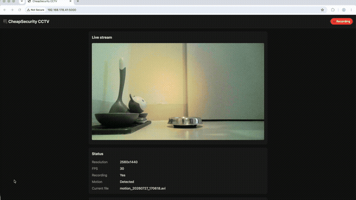

# CheapSecurity
This project provides a lightweight, self-hosted CCTV solution designed for Linux-based single-board computers (SBCs) and standard USB webcams. It offers an affordable, privacy-focused alternative for home monitoring by keeping your video data entirely under your control.



Project Philosophy

- Privacy-First: By storing all footage locally, this system eliminates the need for third-party cloud subscriptions and ensures your data never leaves your network.
- Cost-Effective: Leverage existing hardware—such as a spare Linux board and a USB webcam—to build a fully functional surveillance system without recurring fees.
- Minimalist Architecture: The software is optimized to run efficiently on low-power devices, ensuring high performance even on entry-level hardware.

Key Features

- Hardware Agnostic: Highly compatible with a wide range of standard USB webcams.
- Resource Efficient: Optimized specifically for Linux-based boards (e.g., Raspberry Pi, Orange Pi, or similar SBCs).
- Data Sovereignty: Full control over your storage path, retention policies, and access methods.
- Simple Deployment: Designed for quick setup and easy maintenance.

## Features

- **Live MJPEG stream** with a web dashboard
- **Motion detection** with frame differencing
- **Automatic recording** with a pre-motion buffer
- **Interactive Recordings Calendar**: filter video recordings by date with pulsing red day badges
- **Cloud Storage Integration**:
  - Direct auto-upload of motion recordings to **Google Drive** (via Google Drive API v3)
  - Direct auto-upload of motion recordings to **OneDrive** (via Microsoft Graph API)
- **AES-256 ZIP Upload Encryption**:
  - Independently encrypt video clips and snapshots before uploading to Telegram, Google Drive, or OneDrive
  - Password-protected `.zip` format opens natively on iOS (Files app), Android, macOS, and Windows
  - Manage encryption passphrase and per-channel toggles from dashboard or Telegram bot
- **Email alerts** with a snapshot picture when motion starts
- **Telegram integration**:
  - Automatic video upload after motion is recorded (supports AES-256 encrypted `.zip` delivery)
  - Bot commands: `/snapshot`, `/video <seconds>`, `/encryption`, `/encrypt_telegram_on/off`, `/encrypt_gdrive_on/off`, `/encrypt_onedrive_on/off`, `/sent`, `/delete`, `/delete_range`, `/id`, `/telegram_on/off`, `/email_on/off`, `/help`
- **Night mode** low-light enhancement (software CLAHE + brightness/contrast boost, with optional second IR/night camera)
- **Recordings bulk actions**: select all, send to Telegram, download ZIP, delete
- **Interactive Swagger UI** at `/api/` for the REST API
- **RTSP output** via MediaMTX + FFmpeg (optional, disabled by default)
- **Storage cleanup** by age, total size, and emergency low-disk cleanup
- **systemd autostart** ready
- Licensed under **GNU AGPLv3**

## Requirements

- Python 3.10 or newer
- OpenCV with V4L2 support (see installation options below)
- A USB webcam (`/dev/video0` by default)
- Optional: a Telegram bot token for Telegram notifications
- Optional: SMTP credentials for email alerts

## Quick start

1. Verify OpenCV is available:

   ```bash
   python3 -c "import cv2; print(cv2.__version__)"
   ```
   If OpenCV is not installed, you have two options:

   - **Option A — use a system OpenCV package** (recommended on ARM boards such as the Odroid XU4, where a pre-built system package is usually optimized for the board).
   - **Option B — install OpenCV via pip** (convenient on x86/amd64 machines or when no system package is available). Use `opencv-python-headless` because the app does not need a GUI.

2. Create and activate the virtual environment and install the app:

   ### Option A: system OpenCV (recommended for ARM)

   This creates a venv that can see the system site-packages, so the system `cv2` is available inside the venv.

   ```bash
   cd $HOME/CheapSecurity
   python3 -m venv venv --system-site-packages
   source venv/bin/activate
   pip install -e .
   ```

   ### Option B: install everything via pip

   Use this if you do not have a system OpenCV or prefer a self-contained venv.

   ```bash
   cd $HOME/CheapSecurity
   python3 -m venv venv
   source venv/bin/activate
   pip install opencv-python-headless
   pip install -e .
   ```

   > **Note:** On some older ARM boards the pip `opencv-python-headless` wheel may not be available or may be slow. If that happens, install OpenCV from your distribution’s package manager instead and use Option A.

3. Find your webcam device (usually `/dev/video0`):

   ```bash
   v4l2-ctl --list-devices
   ```

4. Copy `config.json.example` to `config.json` and edit it:
   ```bash
   cp config.json.example config.json
   nano config.json
   ```
   - Set camera device, resolution, and frame rate
   - Fill in SMTP credentials if you want email alerts
   - Fill in Telegram bot token and chat ID if you want Telegram uploads

   > **Security:** `config.json` is listed in `.gitignore` and must never be committed. It contains passwords and tokens. Always edit `config.json`, not `config.json.example`. If you add a new setting, update both files so the example stays in sync.

5. Run the app:

   ```bash
   ./venv/bin/python -m cheapsecurity.app
   ```

6. Open the dashboard in a browser:

   ```
   http://<odroid-ip>:5000
   ```

## Configuration

Edit `config.json`:

| Section | Key | Description |
|---------|-----|-------------|
| `camera` | `device` | V4L2 device index (`0` = `/dev/video0`) |
| `camera` | `width`, `height`, `fps` | Capture resolution and frame rate. Set `width` and `height` to `0` or `"auto"` to automatically detect and use the camera's maximum supported hardware resolution. |
| `camera` | `night_mode` | Enable low-light enhancement / IR camera switching |
| `camera` | `night_mode_strength` | Software enhancement strength: `low`, `normal`, or `aggressive` |
| `camera` | `night_device` | Optional second V4L2 device for night vision (e.g. `1` for `/dev/video1`). Set to `null` to use a single camera. |
| `camera` | `night_device_width`, `night_device_height`, `night_device_fps` | Resolution and FPS of the optional night camera (set `width`/`height` to `0` or `"auto"` for max resolution) |
| `camera` | `night_software_enhance` | Apply CLAHE/gamma to the IR camera feed (`true`/`false`) |
| `camera` | `night_mode_fps` | Target FPS in night mode (camera may ignore this) |
| `camera` | `night_mode_gain` | Target analog gain in night mode (camera may ignore this) |
| `camera` | `night_mode_brightness` | Brightness boost in night mode |
| `camera` | `night_mode_contrast` | Contrast boost in night mode |
| `motion` | `threshold` | Pixel difference threshold (0-255) |
| `motion` | `min_area` | Minimum contour area to trigger motion (full-res pixels) |
| `motion` | `cooldown_seconds` | Keep recording after motion stops |
| `motion` | `scale` | Downscale factor for motion detection (saves CPU) |
| `recording` | `dir` | Where videos are saved |
| `recording` | `max_duration_seconds` | Maximum length of one clip |
| `recording` | `pre_buffer_seconds` | Seconds before motion included in clip |
| `recording` | `codec` | Preferred FourCC codec (`MJPG` for low CPU, `mp4v` for smaller files) |
| `notifications` | `enabled` | Send email alerts on motion |
| `notifications` | `smtp` | SMTP server, port, username, password, TLS |
| `notifications` | `from`, `to`, `subject` | Email sender/recipients/subject (use `["a@...", "b@..."]` for multiple recipients) |
| `notifications` | `min_interval_minutes` | Minimum time between alert emails |
| `telegram` | `enabled` | Send videos to Telegram after motion is recorded |
| `telegram` | `bot_token`, `chat_id` | Telegram Bot API token and destination chat |
| `telegram` | `send_video` | Whether to upload the video file automatically |
| `telegram` | `min_interval_minutes` | Minimum time between Telegram uploads |
| `telegram` | `poll_commands` | Enable `/snapshot`, `/video`, and `/help` bot commands |
| `cloud` | `google_drive` | Google Drive auto-upload configuration (`enabled`, `client_id`, `client_secret`, `refresh_token`, optional `folder_id`) |
| `cloud` | `onedrive` | Microsoft OneDrive auto-upload configuration (`enabled`, `client_id`, `client_secret`, `refresh_token`, `folder_path`) |
| `storage` | `max_age_days` | Delete recordings older than this (default 3 days = 72h) |
| `storage` | `max_size_gb` | Delete oldest files if total exceeds this |
| `storage` | `cleanup_interval_minutes` | How often storage cleanup runs |
| `storage` | `delete_old_on_startup` | If `false`, old recordings are kept when the app restarts |
| `storage` | `emergency_free_space_gb` | If free disk space drops below this, delete old recordings before a new one |
| `storage` | `emergency_delete_count` | How many oldest recordings to delete in an emergency cleanup |
| `rtsp` | `enabled` | Publish an RTSP stream in addition to the HTTP MJPEG stream |
| `rtsp` | `port` | RTSP listener port (default `8554`) |
| `rtsp` | `path` | RTSP path (default `live`) |
| `rtsp` | `width`, `height`, `fps` | Resolution and frame rate for the RTSP stream |
| `rtsp` | `mediamtx_binary` | Path to the MediaMTX executable |
| `rtsp` | `mediamtx_config` | Path to `rtsp/mediamtx.yml` |
| `web` | `host`, `port` | Dashboard bind address and port |
| `web` | `stream_scale` | Downscale factor for live stream (saves bandwidth/CPU) |
| `web.auth` | `enabled`, `username`, `password` | Optional HTTP Basic Auth |

## Telegram setup

### 1. Create a bot

1. Open Telegram and message [@BotFather](https://t.me/BotFather).
2. Send `/newbot` and follow the prompts to choose a display name and username.
3. Copy the **bot token** (looks like `123456789:ABCdefGHIjklMNOpqrsTUVwxyz`).
4. Keep this token secret — anyone with it can control your bot.

### 2. Get your chat ID

1. Start a private chat with your new bot and send any message (for example, `/start`).
2. Open this URL in a browser, replacing `<YOUR_BOT_TOKEN>` with the real token:
   ```
   https://api.telegram.org/bot<YOUR_BOT_TOKEN>/getUpdates
   ```
3. Look for `"chat":{"id":123456789`. The number is your **chat ID**.
   - If `getUpdates` is empty, send another message to the bot and refresh.
   - If you want to use a group chat, add the bot to the group first and send a message there; the chat ID will be negative for groups.
4. Copy the chat ID exactly, including the `-` sign if it is a group.

### 3. Configure the app

Fill in the `telegram` section of `config.json`:

```json
"telegram": {
  "enabled": true,
  "bot_token": "123456789:ABCdefGHIjklMNOpqrsTUVwxyz",
  "chat_id": "123456789",
  "send_video": true,
  "min_interval_minutes": 5,
  "poll_commands": true
}
```

Then restart the service:

```bash
sudo systemctl restart cheapsecurity@$(whoami).service
```


### Automatic uploads

After a motion clip is saved, the video is uploaded to your Telegram chat. Uploads are rate-limited by `min_interval_minutes`.

### Bot commands

From your configured chat, send:

- `/snapshot` — receive the current camera picture
- `/video 10` — record and send a 10-second video (1–60 seconds, default 10)
- `/sent` — list recent bot messages that can be deleted, with their message IDs
- `/delete <message_id>` — delete a bot message from the chat
- `/delete last` — delete the most recent bot message
- `/delete_range <min_id> <max_id>` — delete tracked messages in a range (max 100)
- `/id` — reply to any bot message with this command to see its message ID
- `/telegram_on` / `/telegram_off` — enable or disable automatic Telegram uploads
- `/email_on` / `/email_off` — enable or disable email notifications
- `/help` — list commands

The bot only responds to your configured `chat_id`.

**Motion has priority:** if the system is already recording because motion was detected, a `/video` request will not interrupt it. The bot will reply that a motion video is in progress and will be uploaded automatically.

**Deleting messages and cloud cache:** Telegram bots cannot purge Telegram’s master cloud storage directly. When you delete a message, the media file becomes orphaned and is eventually garbage-collected by Telegram. Only messages sent by this bot after this feature is enabled are tracked; older messages do not have stored IDs and cannot be deleted this way.

## Email alerts

Configure the `notifications` section in `config.json`. A picture from the moment motion starts is attached. Alerts are rate-limited by `min_interval_minutes`.

### Gmail / Google Workspace setup

Google no longer allows "less secure apps" to use your regular Gmail password. You must create an **App Password**.

1. Enable **2-Step Verification** on your Google account:
   - https://myaccount.google.com/signinoptions/two-step-verification
2. Create an App Password:
   - Go to https://myaccount.google.com/apppasswords
   - Select app: **Mail**
   - Select device: **Other (Custom name)** — type "CheapSecurity"
   - Click **Generate** and copy the 16-character password (for example, `abcd efgh ijkl mnop`).
3. In `config.json`, set:
   ```json
   "notifications": {
     "enabled": true,
     "smtp": {
       "server": "smtp.gmail.com",
       "port": 465,
       "username": "you@gmail.com",
       "password": "abcdefghijklmnop",
       "use_tls": true
     },
     "from": "you@gmail.com",
     "to": "you@gmail.com",
     "subject": "CheapSecurity motion alert",
     "min_interval_minutes": 5
   }
   ```
   - Use the **App Password** (no spaces) in the `password` field, not your Google account password.
   - For Google Workspace accounts, the username is usually your full email address.
   - The app uses implicit TLS (`SMTP_SSL`) on the port you configure. Gmail accepts this on port 465.

### Multiple recipients

```json
"to": [
  "you@gmail.com",
  "family@example.com"
]
```

## Night mode

Night mode can work in two ways:

### Single camera (software enhancement)

The default mode improves a dark scene from one USB camera using:

- **Software enhancement** (gamma correction + CLAHE on the L channel)
- **Camera brightness/contrast boost**
- Attempts to lower FPS and raise gain/ISO if the camera supports it

The strength of the software enhancement is selectable from the dashboard or Telegram: `low`, `normal`, or `aggressive`.

**Important:** most USB webcams do not expose ISO/gain/exposure controls via V4L2, so FPS/gain adjustments may be ignored. The result is usually noisy and only useful with some ambient light.

### Dual-camera night vision (hardware/IR)

For real night vision you can connect a second camera such as an **IR-sensitive USB camera** or a camera with an **IR cut filter removed**, optionally with an **IR illuminator**. When `camera.night_device` is set, enabling night mode automatically switches the video source from the day camera to the IR camera; disabling it switches back. Only one camera is open at a time, so USB bandwidth is not doubled.

Example configuration:

```json
"camera": {
  "device": 0,
  "width": 2560,
  "height": 1440,
  "fps": 15,
  "night_mode": false,
  "night_mode_strength": "low",
  "night_device": 1,
  "night_device_width": 1280,
  "night_device_height": 720,
  "night_device_fps": 15,
  "night_software_enhance": false
}
```

- `night_device` — V4L2 device index of the IR camera (e.g. `1` for `/dev/video1`). Set to `null` for single-camera mode.
- `night_device_width/height/fps` — resolution and frame rate of the IR camera.
- `night_software_enhance` — set to `false` if the IR image is already usable; set to `true` if you want the CLAHE/gamma enhancement applied to the IR feed as well.

If the IR camera fails to open, the system falls back to the day camera and logs a warning.

## Storage and cleanup

- Recordings are saved in `recordings/`.
- Recordings older than `max_age_days` are deleted during periodic cleanup, **not** on startup (unless `delete_old_on_startup` is `true`).
- If free disk space drops below `emergency_free_space_gb`, the oldest `emergency_delete_count` recordings are deleted before starting a new clip.
- Recordings older than `max_age_days` or exceeding `max_size_gb` are removed during periodic cleanup.

## REST API & Swagger UI

CheapSecurity exposes a small REST API and serves an interactive **Swagger UI** at:

```text
http://<odroid-ip>:5000/api/
```

The Swagger page documents every endpoint and shows example request/response bodies. You can try the endpoints directly from the browser.

### Authentication

If `web.auth.enabled` is `true`, the API uses **HTTP Basic Auth**. In Swagger, click **Authorize** and enter your username/password. From scripts, include the credentials with curl:

```bash
curl -u admin:changeme http://<odroid-ip>:5000/api/status
```

### CSRF protection

The web dashboard protects POST endpoints with a CSRF check (the `X-Requested-With: XMLHttpRequest` header). Requests made from the Swagger UI page are automatically allowed. From your own scripts, add the header:

```bash
curl -u admin:changeme \
  -H "X-Requested-With: XMLHttpRequest" \
  -X POST http://<odroid-ip>:5000/api/settings/night_mode \
  -H "Content-Type: application/json" \
  -d '{"enabled": true}'
```

### Key endpoints

- `GET /api/status` — current engine state
- `GET /api/recordings` — list saved videos
- `POST /api/recordings/delete` — delete selected recordings
- `POST /api/recordings/download` — download selected recordings as ZIP
- `POST /api/recordings/telegram` — send selected recordings to Telegram
- `POST /api/telegram/delete` — delete a previously sent Telegram message by ID
- `POST /api/telegram/delete_range` — delete tracked Telegram messages in an ID range
- `POST /api/settings/{telegram,night_mode,notifications,auth}` — toggle features
- `POST /api/snapshot` — capture and download a JPEG snapshot
- `POST /api/video` — start a manual recording (default 10s, max 60s)

### Example: snapshot from the command line

```bash
curl -u admin:changeme \
  -H "X-Requested-With: XMLHttpRequest" \
  -X POST http://<odroid-ip>:5000/api/snapshot \
  --output snapshot.jpg
```

### Example: start a 10-second manual recording

```bash
curl -u admin:changeme \
  -H "X-Requested-With: XMLHttpRequest" \
  -X POST http://<odroid-ip>:5000/api/video \
  -H "Content-Type: application/json" \
  -d '{"seconds": 10}'
```

## Web interface

- Live stream
- Status panel (resolution, FPS, recording state, motion state)
- Settings toggles: night mode, email notifications, Telegram uploads, built-in basic auth
- Recordings list with per-row checkboxes and bulk actions:
  - **Select all**
  - **Send to Telegram**
  - **Download selected** (ZIP)
  - **Delete selected**
- Link to the **Swagger API docs** at `/api/`

## Enabling RTSP output (optional)

CheapSecurity can republish the live MJPEG stream as an **RTSP** stream. This lets you view the camera in VLC, IP-camera apps, NVRs, or any software that supports RTSP, without using the web dashboard.

RTSP is **disabled by default** because it adds extra CPU load.

### Quick start: enable RTSP

1. Install **FFmpeg** and **MediaMTX** (see the options below).
2. Make sure `rtsp/mediamtx.yml` exists in the project folder.
3. Set `"rtsp": { "enabled": true, ... }` in `config.json`.
4. Restart the service:
   ```bash
   sudo systemctl restart cheapsecurity@$(whoami).service
   ```
5. Open `rtsp://<odroid-ip>:8554/live` in your RTSP player.

The subsections below explain each step in detail.

### How it works

1. CheapSecurity starts a local **MediaMTX** server on the configured RTSP port.
2. It launches **FFmpeg** to read the HTTP MJPEG stream from `http://127.0.0.1:5000/video_feed`.
3. FFmpeg republishes the stream to MediaMTX on `rtsp://127.0.0.1:<port>/<path>`.
4. Any RTSP client on your network can connect to `rtsp://<odroid-ip>:<port>/<path>`.

### 1. Install dependencies

You need **FFmpeg** and **MediaMTX**.

> **Note:** The commands below use `sudo`. If your board's root access is via `su` instead, run `su` first and execute the commands without `sudo`.

- **FFmpeg** must be installed (`ffmpeg -version`). It is also used for the video-duration fix.
- **MediaMTX** can be installed in several ways:

#### Option A — download a prebuilt binary (fastest)

Download the static binary that matches your board from <https://github.com/bluenviron/mediamtx/releases>. For an Odroid XU4 (ARMv7) choose the ARMv7 build.

```bash
wget https://github.com/bluenviron/mediamtx/releases/download/v1.12.0/mediamtx_v1.12.0_linux_armv7.tar.gz
tar -xzf mediamtx_v1.12.0_linux_armv7.tar.gz
sudo install -m 755 mediamtx /usr/local/bin/mediamtx
```

> Replace `v1.12.0` with the latest release.

Then copy the bundled config file into the project:

```bash
mkdir -p rtsp
cp mediamtx.yml rtsp/mediamtx.yml
```

The repository already contains a minimal `rtsp/mediamtx.yml` that works with the default settings; you only need to copy the one from the MediaMTX archive if you want the upstream defaults.

#### Option B — compile MediaMTX from source on the Odroid

If you prefer to build from source, install Go (≥ 1.26) and build directly on the board:

```bash
# Install Go from your distribution or from https://go.dev/dl/
sudo apt update
sudo apt install golang-go git

# Clone and build
git clone https://github.com/bluenviron/mediamtx /tmp/mediamtx
cd /tmp/mediamtx
go generate ./...
CGO_ENABLED=0 go build .

# Install the binary
sudo install -m 755 mediamtx /usr/local/bin/mediamtx
```

This produces a native ARMv7 `mediamtx` binary.

#### Option C — cross-compile for ARMv7 from another machine

If you want to compile on a faster x86/amd64 machine and copy the binary to the Odroid, use Go cross-compilation:

```bash
git clone https://github.com/bluenviron/mediamtx
cd mediamtx
go generate ./...
CGO_ENABLED=0 GOOS=linux GOARCH=arm GOARM=7 go build .
```

Then copy the resulting `mediamtx` binary to the Odroid, for example:

```bash
scp mediamtx marco@<odroid-ip>:/tmp/mediamtx
ssh marco@<odroid-ip> "sudo install -m 755 /tmp/mediamtx /usr/local/bin/mediamtx"
```

On the Odroid, also copy the config file:

```bash
mkdir -p rtsp
cp mediamtx.yml rtsp/mediamtx.yml
```

### 2. Enable RTSP in `config.json`

```json
"rtsp": {
  "enabled": true,
  "port": 8554,
  "path": "live",
  "width": 1280,
  "height": 720,
  "fps": 15,
  "mediamtx_binary": "/usr/local/bin/mediamtx",
  "mediamtx_config": "rtsp/mediamtx.yml"
}
```

The bundled `rtsp/mediamtx.yml` forces RTSP over **TCP** (`rtspTransports: [tcp]`), which is more reliable through routers and firewalls than UDP. If you prefer UDP on your local network, edit `rtsp/mediamtx.yml` and change it to `[udp, tcp]` or `[udp]`.

Adjust `width`, `height`, and `fps` to match your board’s CPU. Lower resolution and FPS reduce load.

### 3. Restart the service

```bash
sudo systemctl restart cheapsecurity@$(whoami).service
```

### 4. Watch the stream

The stream URL is:

```text
rtsp://<odroid-ip>:8554/live
```

Examples:

- **VLC** → Media → Open Network Stream → paste `rtsp://<odroid-ip>:8554/live`
- **ffplay**:
  ```bash
  ffplay -rtsp_transport tcp rtsp://<odroid-ip>:8554/live
  ```
  > The `-rtsp_transport tcp` flag avoids UDP RTP issues through routers/firewalls. VLC has a similar `--rtsp-tcp` option.
- **Android IP Camera apps** — add a camera with the RTSP URL above.
- **NVR / Home Assistant** — use the same RTSP URL as the camera source.

### 5. Check that it is working

Look for MediaMTX and FFmpeg in the logs:

```bash
sudo journalctl -u cheapsecurity@$(whoami).service -f
```

You should see messages like:

```text
RTSPPublisher: MediaMTX ready on port 8554
RTSPPublisher: FFmpeg publisher started
```

### Performance and troubleshooting

- RTSP is republished from the HTTP MJPEG stream, so it uses extra CPU. On the Odroid XU4, **1280×720 @ 15fps** is a good starting point.
- When HTTP Basic Auth is enabled, FFmpeg is allowed to read `/video_feed` from `localhost` without credentials, so RTSP still works.
- Make sure port `8554/tcp` is open in your firewall if you view it from another machine.
- If the RTSP stream does not appear, verify:
  - MediaMTX binary exists and is executable.
  - `rtsp/mediamtx.yml` exists.
  - FFmpeg is installed.
  - The dashboard stream at `http://<odroid-ip>:5000/video_feed` works.
- If the client connects but shows a black screen / no video, the player probably chose UDP and the RTP packets are being blocked. Force TCP on the client (`-rtsp_transport tcp` in ffplay, `--rtsp-tcp` in VLC) or keep `rtspTransports: [tcp]` in `rtsp/mediamtx.yml` and restart the service.

## Production deployment

Do **not** expose Flask's development server to the internet. Use **Gunicorn** behind the built-in auth or another reverse proxy you trust.

### 1. Install Gunicorn

It is already defined in `pyproject.toml`:

```bash
cd $HOME/CheapSecurity
source venv/bin/activate
pip install -e .
```

### 2. Run with systemd + Gunicorn

Copy the service template and enable it from a user shell:

```bash
sudo cp cheapsecurity.service /etc/systemd/system/cheapsecurity@.service
sudo systemctl daemon-reload
sudo systemctl enable --now cheapsecurity@$(whoami).service
```

This binds Gunicorn to `0.0.0.0:5000` with **one worker and four threads**, so the dashboard and stream are reachable directly on your network. Only one worker is used because the camera must be opened by a single process.

> **Security:** if you expose this to the internet, put a reverse proxy with HTTPS and authentication in front of Gunicorn. If you only access it locally, keep the built-in auth enabled.

View logs:

```bash
sudo journalctl -u cheapsecurity@$(whoami).service -f
```

## Project structure

```
CheapSecurity/
├── src/
│   └── cheapsecurity/     # Python package
│       ├── app.py         # Development launcher
│       ├── cctv.py        # Motion detection, recording, alerts, Telegram bot
│       ├── web.py         # Flask dashboard and APIs
│       ├── wsgi.py        # Production WSGI entry point
│       ├── diagnose.py    # Diagnostic/troubleshooting script
│       ├── templates/     # HTML templates
│       └── static/        # CSS/JS
├── tests/                 # Test suite
├── config.json            # Your local settings (gitignored, never commit)
├── config.json.example    # Example settings template (committed)
├── pyproject.toml         # Package metadata and dependencies
├── cheapsecurity.service  # systemd template
├── LICENSE                # GNU AGPLv3
└── recordings/            # Saved videos
```

## Troubleshooting

If recordings stop appearing:

1. Check the service is running:
   ```bash
   sudo systemctl status cheapsecurity@$(whoami).service
   ```
2. Check logs:
   ```bash
   sudo journalctl -u cheapsecurity@$(whoami).service -f
   ```
3. Run the diagnostic script:
   ```bash
   source venv/bin/activate
   python -m cheapsecurity.diagnose
   ```
4. Try lowering `motion.min_area` if no motion is detected.

## License

This project is licensed under the **GNU Affero General Public License v3.0 or later** (AGPLv3). See `LICENSE`.
